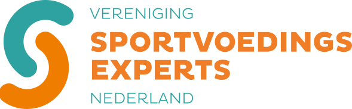

# Merkgids VSN

Vereniging Sportvoedingsexperts Nederland · versie 1.0 · oktober 2026
Afgeleid uit het logo van maart 2026 (`Logo-VSN-FC-2026.svg`), de bestaande site en de nieuwe website. Technische tokens staan in `DESIGN.md` en `src/styles/tokens.css`.

---

## 1. Kern

| | |
|---|---|
| **Naam** | Vereniging Sportvoedingsexperts Nederland |
| **Afkorting** | VSN (altijd in hoofdletters, zonder punten) |
| **Vroegere naam** | Vereniging Sportdiëtetiek Nederland. Niet meer gebruiken, behalve in "voorheen …" |
| **Tagline** | Sport verbeteren met voeding. |
| **Opgericht** | 2004, door Anja van Geel, Geertje Becker en Joris Hermans |
| **Merkwoorden** | energiek · onderbouwd · verbindend |
| **Belofte aan sporters** | Altijd een échte expert in de buurt. |
| **Belofte aan professionals** | Samen sterk: een vereniging vóór en dóór leden. |
| **Titel voor leden** | sportdiëtist-VSN® |

---

## 2. Logo

**Opbouw**
- **Beeldmerk:** twee dikke, afgeronde bogen die in elkaar grijpen en samen een S vormen. Teal boven, oranje onder.
- **Woordmerk:** drie regels. *VERENIGING* (light, teal), *SPORTVOEDINGS EXPERTS* (black, oranje, twee regels), *NEDERLAND* (light, teal).
- **Betekenis:** twee bewegingen die elkaar vasthouden: wetenschap en praktijk, sporter en expert. De bogen lezen ook als de bocht van een atletiekbaan.

**Bestanden**
| Bestand | Gebruik |
|---|---|
| `src/assets/brand/logo-vsn.svg` | Standaard, op lichte achtergronden |
| `src/assets/brand/logo-vsn-dark.svg` | Op donkere vlakken (light-tekst in lichte teal) |
| `public/favicon.svg` | Alleen het beeldmerk: favicon, social avatar, kleine formaten |
| `public/icon-512.png`, `icon-maskable-512.png` | App-iconen |

**Regels**
- Vrije ruimte rondom: minimaal de hoogte van de letter S in SPORTVOEDINGS.
- Minimale breedte: 140 px voor het volledige logo, 24 px voor het beeldmerk.
- Plaats het logo op foto's altijd op een krijtwit vlak (zie de OG-afbeeldingen in `public/og/`).
- **Niet:** kleuren omdraaien, het woordmerk opnieuw zetten in een ander font, uitrekken, schaduw toevoegen, de bogen los gebruiken als logo, of het logo op een drukke foto zonder vlak plaatsen.

---

## 3. Kleur

Strategie: **committed.** Teal en oranje dragen samen het merk. Teal staat voor vertrouwen en structuur, oranje voor energie en actie.

### Merkkleuren (uit het logo)
| Naam | Hex | OKLCH | Gebruik |
|---|---|---|---|
| **VSN Teal** | `#2EA1A1` (web: `#209F9F`) | 0.64 0.103 194.6 | Grafisch, beeldmerk, accenten op donker |
| **VSN Oranje** | `#EF7D00` (web: `#EB7D00`) | 0.70 0.17 57 | Primaire knoppen (met donkere tekst), highlights |

### Uitgebreid palet
| Naam | Hex | Rol |
|---|---|---|
| Krijtwit | `#F9F6F1` | Pagina-achtergrond |
| Krijtwit 2 | `#F2ECE3` | Verdiepte secties |
| Lijn | `#DBD7CF` | Randen, scheidingslijnen |
| Petrol-inkt | `#062427` | Tekst, donkere secties, footer |
| Inkt 2 | `#344D4F` | Secundaire tekst |
| Gedempt | `#53686A` | Metadata |
| Diep teal | `#006C6D` | Links en teal tekst op licht |
| Donker teal | `#003C3F` | Donkere teal vlakken |
| Teal tint | `#CEF0ED` | Lichte vlakken, tags |
| Diep oranje | `#B85207` | Oranje tekst op licht (klein) |
| Display-oranje | `#D06200` | Oranje in grote koppen (≥ 24 px) |
| Oranje tint | `#FDE7CF` | Lichte vlakken |

### Contrastregels (WCAG AA, getoetst)
- Petrol-inkt op krijtwit: 15,1:1
- Diep teal op krijtwit: 5,8:1
- Diep oranje op krijtwit: 4,6:1
- **Petrol-inkt op VSN Oranje: 5,8:1.** Knoppen in oranje krijgen dus donkere tekst. Wit op oranje haalt maar 2,8:1.
- VSN Teal en VSN Oranje zijn niet geschikt voor kleine tekst op licht; gebruik dan de diepe varianten.
- Nooit puur zwart (`#000`) of puur wit (`#fff`).

### Afgeschaft
De oude Elementor-kleuren `#17BEBB`, `#FC621F`, `#232323`, `#007CFF` en `#122B46` passen niet bij het logo en vervallen.

---

## 4. Typografie

**Archivo** (Omnibus-Type, Google Fonts, SIL Open Font License), variabel in gewicht (100–900) en breedte (62–125%). Self-hosted, geen Google-servers.

Waarom: met de breedte-as zet één familie zowel brede, zware sportbelettering (denk aan rugnummers en stadionborden) als rustige leestekst. De expanded black sluit aan bij het geometrische woordmerk.

| Rol | Breedte | Gewicht | Voorbeeld |
|---|---|---|---|
| Display / H1 | 125% | 850–880 | **Sport verbeteren met voeding.** |
| H2 | 118% | 800 | Goede sportvoeding begint onderaan |
| H3 | 110% | 750 | Kennisdeling en verdieping |
| Label | 112% | 650, hoofdletters, +0,08em | VOOR SPORTERS |
| Lead | 100% | 420, 20–23 px | Introductiezinnen |
| Body | 100% | 400, 18 px / 1,6 | Leestekst, max. 68 tekens per regel |

Regels: koppen in zinsopbouw (geen Title Case), labels spaarzaam (maximaal één per sectie), cijfers in tabellen tabular. In Office-documenten: Archivo installeren, anders Arial als vervanger.

---

## 5. Merkmotief: de baan

De twee bogen uit het beeldmerk worden groot ingezet als **baanlijnen**: dikke, afgeronde strepen in teal en oranje die over de rand van foto's en vlakken buigen.
- Maximaal één arc-compositie per scherm.
- Op foto's: overlappend in een hoek, nooit over gezichten.
- Op donker: teal op 16% dekking, oranje vol.
- Animatie: de bogen tekenen zichzelf (1,6 s, ease-out). Uit bij "beweging verminderen".

Tweede motief: de **stippenkaart van Nederland**, waarin elke sportdiëtist een stip is. Gebruik op de site, in presentaties en in het jaarverslag.

---

## 6. Beeld

1. **Eerst eigen beeld.** Studiedagen, sprekers, leden in gesprek, het bestuur. Warm licht, echte mensen.
2. **Sport:** actie, buitenlicht, echte inspanning. Geen poserende fitnessmodellen.
3. **Voeding:** daglicht, natuurlijke materialen, eten zoals sporters het echt eten.
4. **Supplementen nooit als held** van een beeld.
5. Afgeronde hoeken (28 px) of uitgesneden in een boog of cirkel.
6. Alt-teksten beschrijven wat je ziet ("Een lid steekt haar hand op tijdens de VSN studiedag"), niet "afbeelding".

Fotowensen voor een volgende studiedag: portretten van leden in hun praktijk, een sportdiëtist met een sporter aan tafel, close-ups van metingen (ISAK), maaltijdvoorbeelden.

---

## 7. Toon

**Je-vorm**, korte zinnen, concrete getallen.

| Wel | Niet |
|---|---|
| Neem binnen twee uur 0,2–0,4 g eiwit per kg lichaamsgewicht. | Eiwitten zijn super belangrijk voor je herstel!! |
| Vind een sportdiëtist bij jou in de buurt. | Klik hier voor onze sportdiëtisten. |
| Supplementen vullen aan, ze vervangen geen voeding. | Boost je prestaties met de beste supplementen. |
| Word lid van de VSN | Lidmaatschap aanvragen |

- Geen gedachtestreepjes in interfacetekst.
- Knoppen beginnen met een werkwoord: *Zoek*, *Word lid*, *Verstuur bericht*.
- Onafhankelijk: geen merknamen van supplementen in redactionele tekst.

---

## 8. Componenten (website)

- **Primaire knop:** oranje pil, petrol-tekst, pijl die bij hover 4 px opschuift.
- **Secundaire knop:** 2 px petrol-rand, transparant.
- **Zoekveld:** witte pil met oranje locatiepin en oranje zoekknop.
- **Datumblok** (agenda): petrol vlak, dag groot, maand in oranje.
- **Tags:** teal tint (categorie), oranje tint (VSN), lijn (extern).
- **Focus:** 3 px oranje outline met 3 px afstand.
